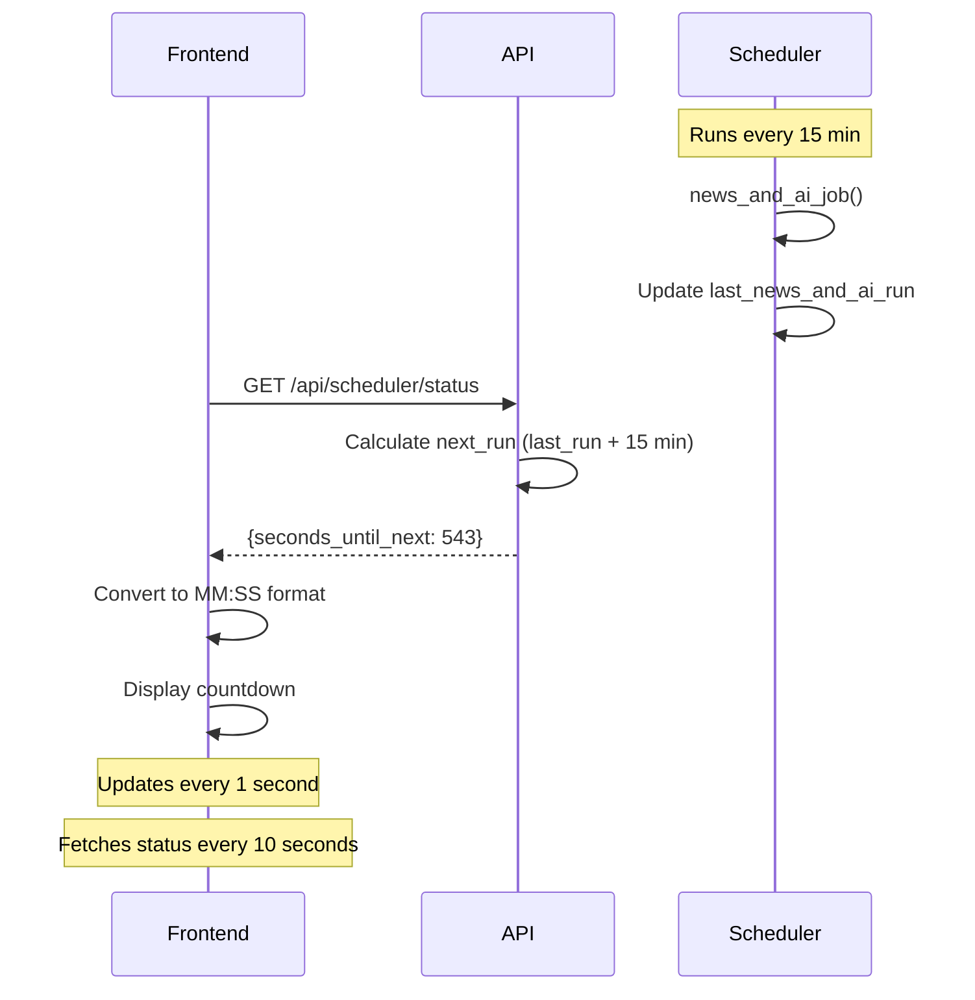

# News + AI Scheduler Countdown Timer

## What Was Added

### Backend Changes (✅ Complete)

**File**: `/Users/rileymartin/tradingbot/app/server.py`

1. **Added tracking variable**:
   ```python
   last_news_and_ai_run = None  # Track last time news + AI job ran
   ```

2. **Updated job to record timestamp**:
   ```python
   def news_and_ai_job():
       global last_news_and_ai_run
       last_news_and_ai_run = datetime.now(timezone.utc)
       # ... rest of job
   ```

3. **Added API endpoint** `/api/scheduler/status`:
   ```python
   @app.get('/api/scheduler/status')
   def api_scheduler_status():
       # Returns countdown information
   ```

**API Response**:
```json
{
  "last_run": "2025-10-28T12:30:00Z",
  "next_run": "2025-10-28T12:45:00Z",
  "seconds_until_next": 543,
  "interval_minutes": 15,
  "status": "scheduled"
}
```

### Frontend Changes (✅ Complete)

**File**: `/Users/rileymartin/tradingbot-frontend/app/page.tsx`

1. **Added state variables**:
   ```typescript
   const [schedulerStatus, setSchedulerStatus] = useState<{...} | null>(null);
   const [countdown, setCountdown] = useState<string>('--:--');
   ```

2. **Added scheduler status fetcher** (runs every 10 seconds):
   ```typescript
   useEffect(() => {
     const fetchSchedulerStatus = async () => {
       const response = await fetch(`${API_BASE}/api/scheduler/status`);
       const data = await response.json();
       setSchedulerStatus(data);
     };
     // Fetch every 10 seconds
   }, []);
   ```

3. **Added countdown updater** (runs every second):
   ```typescript
   useEffect(() => {
     const updateCountdown = () => {
       // Calculate time remaining
       const minutes = Math.floor(diff / 60000);
       const seconds = Math.floor((diff % 60000) / 1000);
       setCountdown(`${minutes}:${seconds}`);
     };
     // Update every second
   }, [schedulerStatus]);
   ```

4. **Added countdown display** in header:
   ```tsx
   <div className="flex items-center gap-2 px-3 py-1.5 bg-blue-50 ...">
     <HiNewspaper />
     <div>
       <span>Next News Fetch</span>
       <span>{countdown}</span>
     </div>
   </div>
   ```

## How It Looks

### In the Dashboard Header

```
Trading Dashboard  🟢  📰 Next News Fetch
                        14:23
```

The countdown shows:
- `MM:SS` format (e.g., `14:23` = 14 minutes 23 seconds)
- `--:--` when waiting for first run
- `00:00` when job is about to run or running

### Visual Details

- **Blue background** - Soft blue badge that stands out
- **Newspaper icon** - Clear visual indicator
- **Live updating** - Updates every second
- **Auto-refreshing** - Fetches latest status every 10 seconds

## Testing

### 1. Start Backend
```bash
cd /Users/rileymartin/tradingbot
# Start your backend server
```

**Check logs for**:
```
📰🤖 Combined News + AI scheduler started (runs every 15 minutes)
```

### 2. Start Frontend
```bash
cd /Users/rileymartin/tradingbot-frontend
npm run dev
```

### 3. Open Dashboard
```
http://localhost:3000
```

**You should see**:
- Countdown timer in the header next to backend status
- Timer counting down from 15:00 to 00:00
- Timer resets to 15:00 after reaching 00:00

### 4. Manual Test
Trigger a manual news fetch:
```bash
curl -X POST http://localhost:8000/api/runs/refresh
```

**Watch**:
- Countdown should reset to `15:00` immediately after job completes
- Job runs in backend logs

### 5. Wait for Automatic Run
Wait up to 15 minutes and observe:
- Countdown reaches `00:00`
- Backend logs show news fetch + AI decisions running
- Countdown resets to `15:00`
- Process repeats every 15 minutes

## How It Works



## Benefits

✅ **Transparency** - Users know exactly when next fetch happens  
✅ **Real-time** - Countdown updates every second  
✅ **Accurate** - Syncs with actual scheduler  
✅ **Visual** - Clear, prominent display  
✅ **Non-intrusive** - Compact, fits naturally in header  

## Edge Cases Handled

| Scenario | Behavior |
|----------|----------|
| Server just started | Shows `--:--` until first run |
| Job running now | Shows `00:00` |
| Job overdue | Shows `00:00` (prevents negative) |
| Backend disconnected | Shows `--:--` (graceful fallback) |
| Multiple tabs open | Each tab fetches independently |

## Future Enhancements (Optional)

- [ ] Add progress bar in addition to countdown
- [ ] Show "Running now..." when job is executing
- [ ] Add notification when countdown reaches 00:00
- [ ] Show last successful run time as tooltip
- [ ] Add manual trigger button next to countdown
- [ ] Animate countdown when nearing zero (e.g., pulsing)
- [ ] Add separate countdown for tips scheduler (10 min)

---

**Status**: ✅ **COMPLETE**  
**Date**: October 28, 2025  
**Backend**: News + AI scheduler tracked, API endpoint added  
**Frontend**: Countdown timer displayed in header

